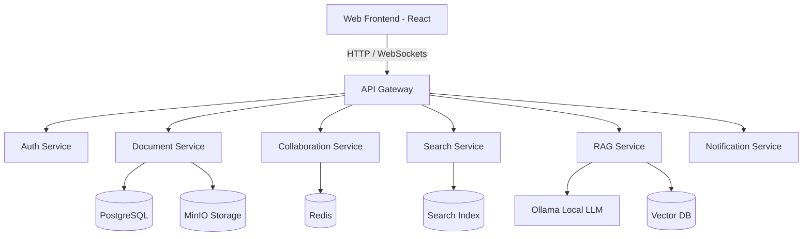

<h1 align="center">Doc-Collab-System</h1>

<p align="center">
  <strong>An advanced, real-time document collaboration platform integrated with AI-driven capabilities.</strong><br>
  Built with a microservices architecture, it enables seamless multi-user editing, powerful search, and Retrieval-Augmented Generation (RAG) powered by local LLMs.
</p>

## ✨ Features

- **Real-Time Collaboration:** Co-author documents in real-time with multiple users, powered by Redis and WebSockets.
- **Rich Text Editing:** A robust frontend editor built with React and Tiptap (ProseMirror).
- **AI & RAG Integration:** Local LLM support via Ollama, allowing for context-aware document queries and AI assistance without sending data to external APIs.
- **Microservices Architecture:** Highly scalable backend divided into specialized, decoupled services.

## 🏗️ Architecture



## 🛠️ Tech Stack

### Frontend
- **Framework:** React 18 & Vite
- **Editor:** Tiptap / ProseMirror

### Backend & Microservices
- **Framework:** Python / FastAPI
- **Database:** PostgreSQL (Primary), Redis (Pub/Sub & Caching)
- **Storage:** MinIO (S3-compatible object storage)

### AI & Infrastructure
- **AI Models:** Ollama (Local GPU-accelerated LLMs)
- **Deployment:** Docker & Docker Compose

## 🚀 Getting Started

### Prerequisites
- [Docker](https://www.docker.com/) and [Docker Compose](https://docs.docker.com/compose/)
- Nvidia Drivers and Docker GPU support (if utilizing GPU for Ollama)
- Node.js (for local frontend development)

### Running the Application

1. **Clone the repository:**
   ```bash
   git clone <repository-url>
   cd doc-collab-system
   ```

2. **Start the backend and infrastructure:**
   Use Docker Compose to build and bring up all microservices.
   ```bash
   docker-compose up --build
   ```

3. **Access the services:**
   - **API Gateway:** `http://localhost:8000`
   - **MinIO Console:** `http://localhost:9001`
   
4. **Run the Frontend (Local Development):**
   ```bash
   cd frontend
   npm install
   npm run dev
   ```

## 🗺️ Roadmap & Future Enhancements

We are continuously evolving the platform. Here are some of the features planned for future releases:

### Collaboration & Organization
- **Presence & Activity:** Real-time presence (who's viewing/editing) and a detailed per-document timeline.
- **Advanced Permissions:** Granular roles (Owner, Editor, Commenter, Viewer) and external sharing links with expiry.
- **Folders & Tags:** Better document organization using folders, tags, and pinned items.
- **Offline Mode:** Local caching with automatic sync upon reconnection.

### Editing Experience
- **Inline Comments:** Comment threads with @mentions and a resolve/reopen workflow.
- **Version History:** View diffs between versions, restore previous states, and create named snapshots.
- **Enhanced Editor:** Native support for tables, images, code blocks, math formatting, and checklists.
- **Import/Export:** Support for DOCX, PDF, Markdown, and ODT files.

### AI & Intelligence
- **AI Enhancements:** Built-in actions to summarize, rewrite, translate, and extract action items.
- **Smart Citations:** RAG-powered citations with "source highlights" directly within the document.
- **Personalized Context:** RAG indexes isolated per user/workspace with strict privacy boundaries.

### Security & Enterprise
- **Security Hardening:** 2FA, SSO integrations, and comprehensive device/session management.
- **Audit Logs:** Full logging for compliance (tracking who accessed/changed what, and when).
- **Admin Console:** Organization settings, user management, billing, and usage analytics.
- **API Access:** Developer APIs with API keys, rate limiting, and webhook integrations (Slack, Teams).
